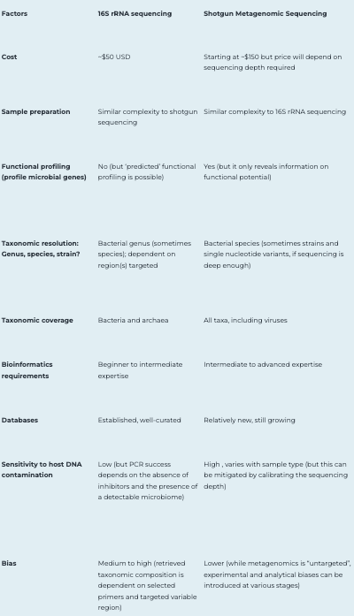

# **Tips and considerations for designing a study** 

# 1. FIRST = Determine what your downsteam goals are for the sequencing data
## For example, you will have different sequencing requirements if you want to simply obtain data which describes what organisms are present in a sample vs if you plan to do something more complex such as funcional pathway analysis. 
Essentially, with more data resolution comes a higher price tag and greater computational requirements/expertise!

# 2. Decide between 16S marker gene sequencing or shotgun:
## Once you've established the types of things you would like to be able to do with your data, first choose between classic 16S marker gene sequencing or shotgun sequencing. 

In short, 16S is much less expensive and easier to process, shotgun sequencing is more expensive, harder to process, but you gain additional information about your samples. 

**What is 16S marker gene sequencing?** = amplicon sequencing that targets and reads an area of the 16S rRNA gene, which is found in all Bacteria and Archaea, so it can only define these microorganisms. Other kinds of amplicon sequencing, like ITS sequencing for fungi or 18S sequencing for protists, can distinguish various microorganisms. The result of 16S rRNA sequencing is sequencing 'reads' (DNA sequence strings) that can be analyzed using a number of basic bioinformatic processes, which are referred to as 'pipelines' when they are integrated. These bioinformatic pipelines 'clean' the data by removing sequencing errors or questionable reads, which can then be associated with microbial genomic databases to correctly determine and profile the bacteria (and archaea) that were visible in the specimens.

**16S best applications** - 16S rRNA sequencing has been used extensively in microbiome research to identify the composition of bacteria and archaea within a wide variety of microbiomes. This means that 16S sequencing can only identify certain microbes (bacteria, archaea, and microeukaryotes) and **cannot** examine their genetic potential.

**What is shotgun sequencing?** = entails breaking ('fragmenting') DNA into many tiny chunks at random, similar to how a shotgun would tear something up into many pieces. The DNA sequences of these fragmented pieces of DNA are then stitched back together using bioinformatics to recognize the species and genes existing in the specimen. Shotgun metagenomic sequencing, unlike 16S rRNA sequencing, can read all genomic DNA in a specimen rather than just one particular area. Shotgun sequencing can simultaneously identify and profile bacteria, fungi, viruses, and a variety of other microorganisms, which is useful for microbiome research. As genomes are sequenced, microbial genes observed in the specimen (the metagenome) can be identified and profiled, providing additional information about the microbiome's functional potential. When compared to 16S rRNA sequencing, metagenomic sequencing requires a few extra steps. To evaluate the outcomes of shotgun sequencing reads, more complicated bioinformatics techniques are utilized. Quality filtering steps are also included in shotgun metagenomics bioinformatics pipelines, after which the cleaned sequencing data can be compiled to generate partial or full microbial genomes or aligned to databases of microbial marker genes. Many of these pipelines now include online tutorials and user interfaces to help people who aren't experts in bioinformatics with their analyses. The findings include information on the relative abundances of bacteria, fungi, viruses, and other microbes in the specimen, as well as curated lists of microbial genes.

**Shotgun best applications** - Shotgun sequencing can read all parts of the genome, meaning that it can also identify microbial genes and their potential functions. Not only can shotgun sequencing identify many different types of microbes already in databases, it can also be used to discover new species, called metagenomic-assembled genomes (MAGs). Therefore, shotgun sequencing can provide a full insight into microbiome composition, gene diversity and genomic diversity.

## Here are some helpful tools when choosing between these two methods:
[**Comparison between 16S rRNA and shotgun sequencing data for the taxonomic characterization of the gut microbiota**](https://www.nature.com/articles/s41598-021-82726-y)

## If you determine that 16S sequencing is adequate for your analytical purposes: 

# 3. If you've chosen shotgun, select between shallow or deep sequncing: 
Deep shotgun metagenomics or Shotgun metagenomics sequencing (SMS) can elucidate the community structure and species classification, as well as provide insights into systemic evolution, gene function, metabolic network, and antibiotic resistance gene information. However, the deep insights with shotgun metagenomic sequencing come with a significantly higher cost than 16S sequencing. 

Sequencing at different sequencing depths allows for multiple applications and analysis purposes. Shallow shotgun metagenomic sequencing (SSMS) has emerged as an approach to bridge the gap between 16S sequencing and deep metagenomic sequencing. SSMS is cost-competitive with 16S sequencing, while also providing species-level resolution.

**"The short answer is there is no easy way to estimate read depth required for shotgun metagenomics sequencing."** Let’s assume you were dealing with a simple sample that had 10 bacterial species and wanted 100x coverage depth for de no assembly. If your 10 bacterial species had an estimated genome size of 2 Mb, you’d aim for around 2 Gb of sequencing data per sample.

**10 dominant bacterial species * 100x * 2 Mb = 2 Gb**

This is a very simplistic calculation. In most metagenomics studies there are thousands or millions of species you need to contend with. If you’re sampling microbes where there is a host involved, then you need to consider accounting for all the reads that will be lost to sequencing host DNA. Much of these reads will be removed by mapping, but they still need to be accounted for.

## Since there isn't a "one size fits all" answer to "what should your sequencing depth be?", here are a few tips:
1. If you have a specific type of downstream analysis you are planning to do, look for papers which have done that type of analysis or something very closely related. The methods/supplement should include their sequencing depth and you can plan to use that as a baseline. 
2. The fewer reads per sample you have, the less you will be able to do
3. A ballpark MINIMUM for taxonomy only with shallow sequencing would be 2 million reads/sample. [defining shallow sequencing](https://www.nature.com/articles/s41598-023-33489-1)

## This table outlines the main differences and requirements for both shallow and deep shotgun sequencing: 

## Here are how the downstream analyses will be impacted depending on depth of sequencing: 

# 4. For shotgun sequencing, choose what type of machine you will use for the run
## Within Illumina, there are many different machines which accomodate a wide range of parameters. Below I have included some tables which help to differentiate between these options: 

In addition, on the Illumina website there is a [**LINK**](https://www.illumina.com/systems/sequencing-platforms/comparison-tool.html#/) which helps to narrow down what machine is best suited for your study. NOTE: THE NUMBER OF SAMPLES WILL IMPACT SEQUENCING DEPTH (i.e., if you have a ton of samples packed on a single run, you will get lower coverage of each of these. Whereas if you have fewer samples, the coverage will be greater.) Finally, the sequencing center you are using should be able to answer any specific questions and help to ensure you get the best possible results. 
